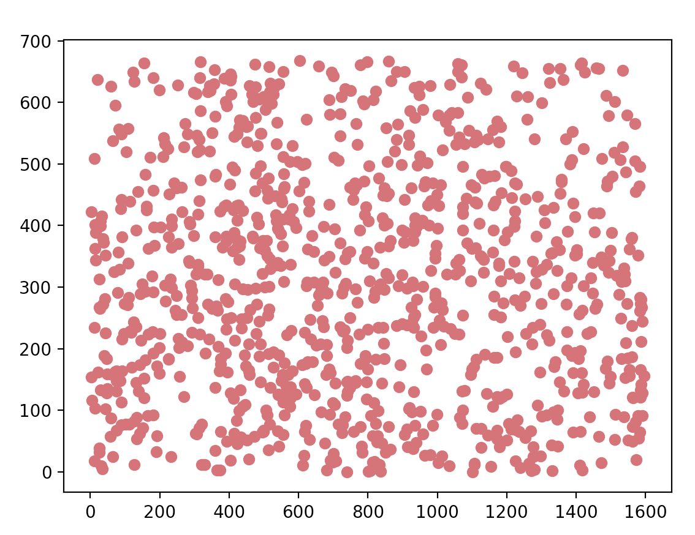
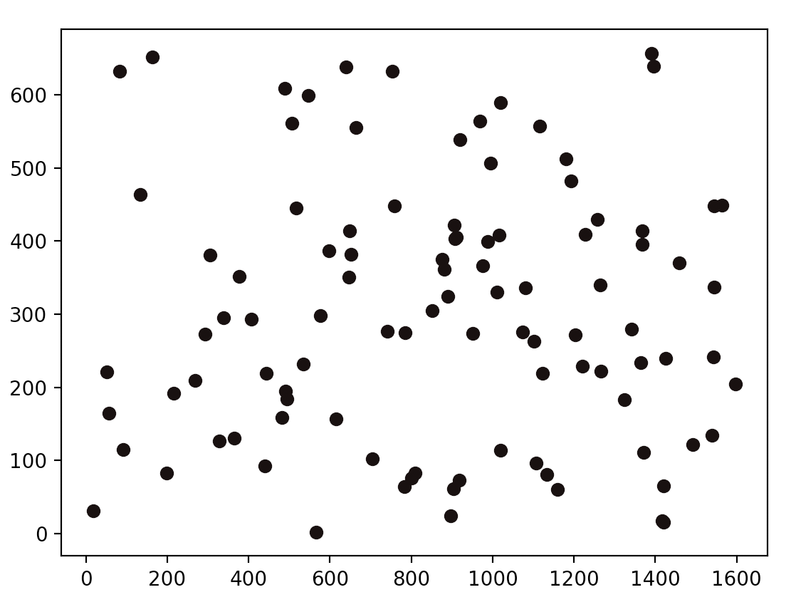
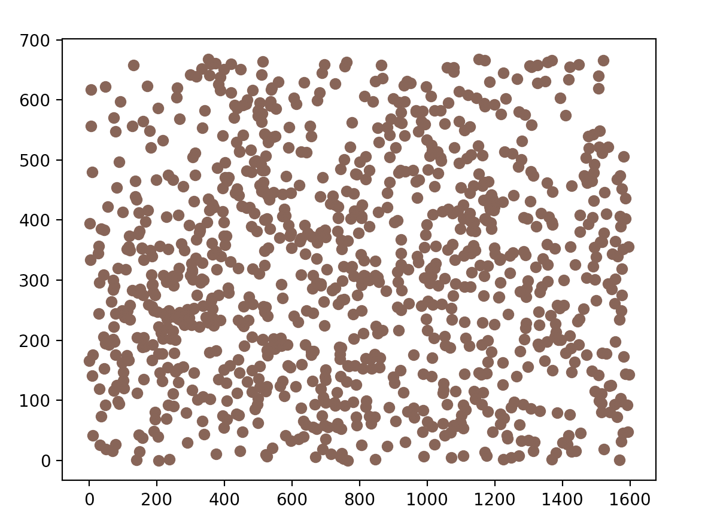

# Pointillism_Art

Status: Terminated

Summary: Pointillism is an art movement that utilizing small dots of color to compose an image. The point.py file takes in an image and produces an image that applies the the constructs of pointillism.

Issues: Using Matplotlib and cv2 to generate pointillism art creates many nuances throughout development because the libraries don't communicate very well with each other. An issue that arose was the requirement to convert GBR to RGB to hexadecimal in order to receive the correct colors for the dots. This is because the libraries have things formatted differently and have specific requirements. Another issue I encountered was ```IndexError: index 1137 is out of bounds for axis 0 with size 670```. This mean in the cv2 library the axis only went so far. One way to resolve this issue is to resize the image using ```resize = cv2.resize(myImage,(360,480))```. I needed to communicate the resized image throughout my code to make sure everything is cohesive. In other terms, I needed to jump back and forth between libraries making changes and adjustments. I have come to the conclusion that for this project matplotlib and cv2 do not communicate very well. I can try to force both libraries to interact with each other but, in the grand scheme of things it doesn't make adequate sense.

Here is what I managed to generate:






